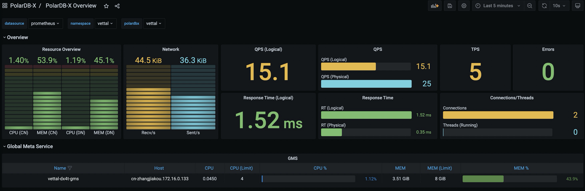

# 监控 
本文介绍如何在 K8s 集群中为 PolarDB-X 数据库开启监控功能。

## 安装 PolarDB-X Monitor

PolarDB-X 通过 Prometheus 和 Grafana 来监控 PolarDB-X 集群。PolarDB-X Monitor 集成了  [kube-promethus](https://github.com/prometheus-operator/kube-prometheus) 组件栈，通过安装 PolarDB-X Monitor 即可一键部署监控所需的资源和组件。
### 前置要求
1. 已经准备了一个运行中的 K8s 集群，并确保集群版本 >= 1.18.0
2. 已经安装了 [Helm 3](https://helm.sh/docs/intro/install/)
3. 已经安装 PolarDB-X Operator 1.2.0 及以上的版本

### Helm 包安装 
首先创建一个名为 polardbx-monitor 的命名空间:
```bash
kubectl create namespace polardbx-monitor
```

安装 PolarDBXMonitor CRD: 
```bash
kubectl apply -f https://raw.githubusercontent.com/ApsaraDB/galaxykube/v1.2.0/charts/polardbx-operator/crds/polardbx.aliyun.com_polardbxmonitors.yaml
```
> 注：如果您的 PolarDB-X Operator 1.2.0 是通过 helm install 直接安装的，PolarDBXMonitor 的 CRD 会默认安装，可以跳过这步。如果您的 PolarDB-X Operator 是 从1.1.0 及以下的低版本通过 helm upgrade 升级而来，需要执行如下命令手工安装：

执行如下命令安装 PolarDB-X Monitor：
```bash
 helm install --namespace polardbx-monitor polardbx-monitor https://github.com/ApsaraDB/galaxykube/releases/download/v1.2.1/polardbx-monitor-1.2.1.tgz
```

您也可以通过 PolarDB-X 的 Helm Chart 仓库安装:
```bash
helm repo add polardbx https://polardbx-charts.oss-cn-beijing.aliyuncs.com
helm install --namespace polardbx-monitor polardbx-monitor polardbx/polardbx-monitor
```
> 注：通过这种方式安装 Prometheus 和 Grafana 采用的都是默认配置便于快速体验。如果部署在生产集群，你可以参考[定制 PolarDB-X Monitor 配置](#configure_prometheus_grafana)

> 注：如果您是在 minikube 上安装 PolarDB-X Monitor, 可能会因为资源不够导致组件无法创建，可以参考[配置 Prometheus 和 Grafana 规格](#configure-spec) 调整组件的规格

期望看到如下输出：
```
polardbx-operator monitor plugin is installed. Please check the status of components:

    kubectl get pods --namespace {{ .Release.Namespace }}

Now start to monitor your polardbx cluster.

```

PolarDB-X Monitor 安装完成后，会在您 K8s 集群的 polardbx-monitor 命名空间下创建 prometheus 和 grafana 等组件，以此来监控 K8s 内的 PolarDB-X，通过如下命令检查相关组件是否正常，确认所有的 pod 都处于 Running 状态。
```bash
kubectl get pods -n polardbx-monitor
```

## 开启 PolarDB-X 监控
PolarDB-X 集群的监控采集功能默认是关闭的，需要为您需要监控的 PolarDBXCluster 创建 PolarDBXMonitor 对象进行开启。
```bash
kubectl apply -f polardbx-monitor.yaml
```

其中 polardbx-monitor.yaml 的yaml 描述如下:
```yaml
apiVersion: polardbx.aliyun.com/v1
kind: PolarDBXMonitor
metadata:
  name: quick-start-monitor
spec:
  clusterName: quick-start
  monitorInterval: 30s
  scrapeTimeout: 10s
```

* spec.clusterName: 需要开启监控的 PolarDB-X 集群名称
* spec.monitorInterval: 监控数据采集频率，默认30s
* spec.scrapeTimeout: 监控数据采集的超时时间，默认10s


## 访问 Grafana Dashboard


默认情况下执行如下命令将 Grafana 端口转发到本地：
```bash
kubectl port-forward svc/grafana -n polardbx-monitor 3000
```
在浏览器中输入: http://localhost:3000, 即可访问到 PolarDB-X Dashboard，默认的用户名和密码都是 admin。
> 注：由于 Grafana 的配置存储在 ConfigMap 中，您在 Grafana 中修改的密码或者新增的 Dashboard 不会被持久化，一旦 Grafana Pod 重建，这部分配置会丢失，请注意提前保存。

 

如果您的 K8s 集群中支持 LoadBalancer，你可以为 Grafana 的 Service 配置 LoadBalancer 进行访问，详见：[配置 LoadBalancer](#configure_load_balancer)

如果您的 K8s 集群内有多个 PolarDB-X Cluster，可以通过 Grafana 页面上面的下拉框切换 Namespace 和 PolarDB-X Cluster。

## 访问 Prometheus  

默认情况下执行如下命令将 Prometheus 端口转发到本地：
```bash
kubectl port-forward svc/prometheus-k8s -n polardbx-monitor 9090
```
在浏览器中输入: http://localhost:9090, 即可访问到 Prometheus页面。

如果您的 K8s 集群中支持 LoadBalancer，你可以为 Prometheus 的 Service 配置 LoadBalancer 进行访问，详见：[配置 LoadBalancer](#configure_load_balancer)

## <a name="configure_prometheus_grafana">定制 Prometheus 和 Grafana 配置</a>

PolarDB-X Monitor 的 helm chart 采用了默认的 Prometheus 和 Grafana 配置，如果您想修改相关配置，可以使用如下的命令安装或者升级 PolarDB-X Monitor，通过 values.yaml 覆盖默认的配置。
```bash
 helm install --namespace polardbx-monitor polardbx-monitor polardbx-monitor-1.2.0.tgz -f values.yaml
```
或者：
 ```bash
 helm upgrade --namespace polardbx-monitor polardbx-monitor polardbx-monitor-1.2.0.tgz -f values.yaml
 ```
values.yaml 文件包含了 Prometheus 和 Grafana 的相关配置项，下面针对常见的几种场景给出配置示例，详细的配置列表详见：[values.yaml](https://raw.githubusercontent.com/ApsaraDB/galaxykube/v1.2.1/charts/polardbx-monitor/values.yaml)。

### <a name="configure_load_balancer">配置 LoadBalancer</a>
如果您的 K8s 集群支持 LoadBalancer，可以在安装或者升级 PolarDB-X Monitor 的时候通过 -f 参数指定如下配置：
```yaml
monitors:
  grafana:
    serviceType: LoadBalancer
  prometheus:
    serviceType: LoadBalancer
```

### <a name="configure_monitor_data">持久化监控数据</a>
默认配置创建的 Prometheus 集群的监控数据是不持久化的，存在数据丢失的风险，您可以通过如果的values.yaml 指定数据持久化的目录
```yaml
monitors:
  prometheus:
    persist: true
    # K8s 集群内支持的 storage class
    storageClassName: ssd
    # 存储空间的大小
    storageRequest: 100G
```

### <a name="configure-spec">配置 Prometheus 和 Grafana 规格</a>
默认配置中，Prometheus 集群包含1个节点，每个节点限定8C16G资源，Grafana包含1个节点，每个节点限定4C8G的资源，您可以通过如下配置项修改 Prometheus 和 Grafana集群的规格和节点数量：
```yaml
monitors:
  grafana:
    resources:
      requests:
        cpu: 1000m
        memory: 2Gi
      limits:
        cpu: 2000m
        memory: 8Gi
  prometheus:
    resources:
      requests:
        cpu: 1000m
        memory: 2Gi
      limits:
        cpu: 2000m
        memory: 8Gi
```
